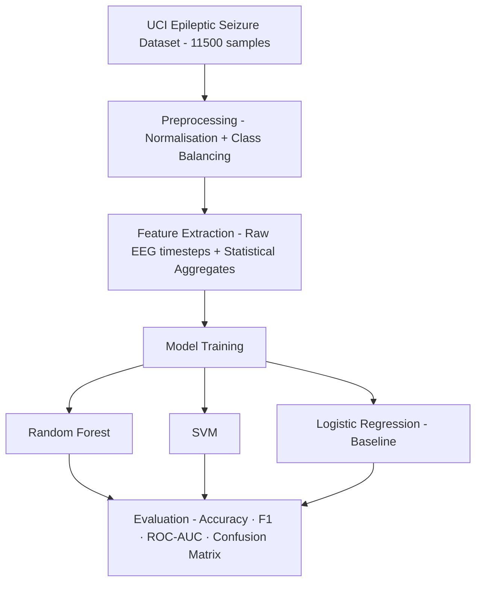

# 🧠 EEG-Based Epileptic Seizure Detection

> Automated seizure classification from EEG signals using classical ML and
> signal processing — 95%+ accuracy on the UCI Epileptic Seizure Recognition Dataset.


---

## 🎯 What This Does

Epileptic seizures produce distinct abnormal electrical patterns in the brain.
This pipeline classifies EEG signal segments as **seizure or non-seizure**
automatically — no manual expert review required.

**95%+ accuracy · Binary classification · 11,500 EEG samples · 178 time-series features**



---

## 📂 Dataset

| Property | Detail |
|----------|--------|
| Source | UCI Epileptic Seizure Recognition Dataset |
| Samples | 11,500 EEG segments |
| Features | 178 time-series data points per segment |
| Task | Binary — Seizure (1) vs Non-Seizure (0) |
| Class balance | Balanced after preprocessing |

---

## ⚙️ Pipeline

| Stage | Details |
|-------|---------|
| **Preprocessing** | Normalisation · class balancing |
| **Features** | Raw EEG time-steps + statistical aggregates |
| **Models** | Random Forest · SVM · Logistic Regression |
| **Evaluation** | Accuracy · F1 Score · Confusion Matrix · ROC-AUC |

---

## 📊 Results

| Model | Accuracy | F1 Score |
|-------|----------|----------|
| **Random Forest** | **~95%+** | — |
| SVM | — | — |
| Logistic Regression (baseline) | — | — |

---

## 🔑 Key Findings

- **Random Forest** significantly outperforms logistic regression baseline
  on this high-dimensional time-series classification task
- Raw EEG time-steps alone carry strong discriminative signal —
  seizure segments show characteristic high-frequency bursts
- Class balancing was critical — imbalanced training produced
  misleading accuracy scores favouring the majority class

---

## 🚀 Getting Started

```bash
git clone https://github.com/rishita-nigam/Epileptic-Seizure-Prediction.git
cd Epileptic-Seizure-Prediction
pip install -r requirements.txt
python seizure_detection.py
```

---

## 📦 Requirements

```
pandas
numpy
scikit-learn
matplotlib
seaborn
```

```bash
pip install -r requirements.txt
```

---

## 🏫 About

Built as an independent ML project exploring signal processing and
classification for biomedical applications.

**Author:** Rishita Nigam · [LinkedIn](https://linkedin.com/in/rishitanigam) · [GitHub](https://github.com/rishita-nigam)

---

## 📄 License

Academic use. Free to use and build upon with attribution.
